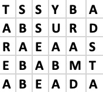
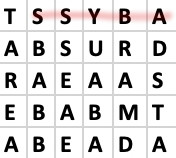
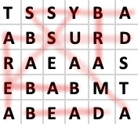

# word-search-rust
**Word Search** solver and generator in Rust

A solver and generator of Word Search Puzzles with hidden messages.

### Word Search Puzzles

Sometimes called CruciPuzzle, this is a variant of the word search puzzles where, once all the words have been found the remaining letters will form an hidden message, which is the solution to the puzzle.

Like for a standard Word Search Puzzle, the input is a rectangular grid of letters and a list of words.
The words are hidden in the grid and can be written horizzontally, vertically or diagonally, in one sense or the other.
The minimum word length is 3 letters.
Words can overlap but every word must have at least one letter that belongs only to that word.

E.g. let's take the following grid:

And the following list of words:
* **ABYSS**
* **ABSURD**
* **AMASS**
* **AREA**
* **BABE**
* **BEAD**
* **BRA**
* **EASY**

We then proceed to mark the words that we find the grid. For instance if we look at the first row we can see that it contains the word ABYSS spelled backwards. So we can mark it out.

We then proceed to mark all words.

The remaining letters will form the solution: **TEST**

### Format
The format for the puzzle (expected by the solver and used by the generator) is a plain text file, with the grid first, then one empty line and finally the words to find, one per line. Just run the generator to see a valid example.

### Binaries
The projects will create two binaries: solver and generator.

#### Solver
cargo run --bin solver <input_file>
   
#### Generator:
cargo run --bin generator <width> <height> -s <message> [-d <dictionary_file>]

